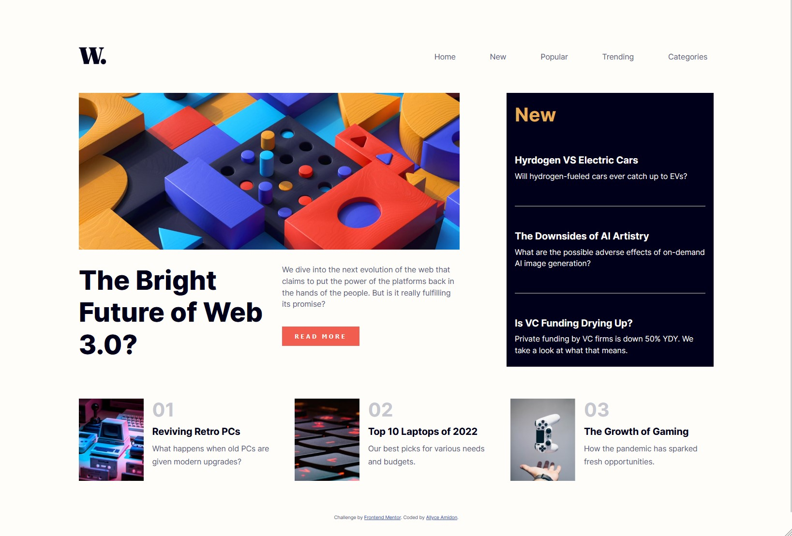
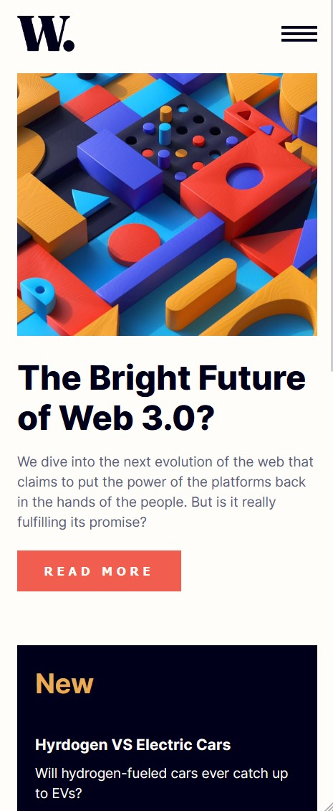

# Frontend Mentor - News homepage solution

This is a solution to the [News homepage challenge on Frontend Mentor](https://www.frontendmentor.io/challenges/news-homepage-H6SWTa1MFl). Frontend Mentor challenges help you improve your coding skills by building realistic projects. 

## Table of contents

- [Overview](#overview)
  - [The challenge](#the-challenge)
  - [Screenshot](#screenshot)
  - [Links](#links)
- [My process](#my-process)
  - [Built with](#built-with)
  - [What I learned](#what-i-learned)
  - [Continued development](#continued-development)
  - [Useful resources](#useful-resources)
- [Author](#author)


## Overview

### The challenge

Users should be able to:

- View the optimal layout for the interface depending on their device's screen size
- See hover and focus states for all interactive elements on the page
- Toggle the mobile menu

### Screenshot




### Links

- Solution URL: [https://github.com/amidona/news-hompage-fm](https://github.com/amidona/news-hompage-fm)
- Live Site URL: [Add live site URL here](https://your-live-site-url.com)

## My process

### Built with

- Semantic HTML5 markup
- CSS custom properties
- Flexbox
- Mobile-first workflow
- Vanilla JavaScript


### What I learned

I finally worked out how to do the modal nav with CSS and JavaScript so that the background was grayed out.

```css
nav {
    background-color: rgba(0, 0, 0, 0.4);
    display: none;
    height: 100%;
    justify-content: flex-end;
    left: 0;
    overflow: auto;
    position: fixed;
    top: 0;
    width: 100%;
    z-index: 1;    
}

#nav-content {
    background-color: hsl(36, 100%, 99%);
    height: 100%;
    padding: 15px;
    position: fixed;
    width: 60%;
}
```
```js
//Open nav menu on mobile
open.onclick = () => nav.style.display = "flex";

//Close nav menu on mobile using the X
close.onclick = () => nav.style.display = "none";
close.onmouseover = () => document.body.style.cursor = "pointer";
close.onmouseout =  () => document.body.style.cursor = "default";

//Close nav menu on mobile when you click to go to a section
navItem.forEach(navItem => navItem.onclick = function () {
    if (nav.style.display = "flex") {
        nav.style.display = "none"
    } else {
        return
    }
});

// Close nav menu on mobile when you click outside the nav
window.onclick = function(event) {
    if (event.target == nav) {
        nav.style.display = "none";
    }
} 
```

### Continued development

I'm not completely happy how the Trending section images grow and shrink with their attached stories. They look good at certain widths (e.g., when they match the brief design), but not at "weirder" widths. If I was going to spend more time on this, I'd also like to play around with designs for tablet widths, though they weren't requested in the brief.

### Useful resources

- [W3 Schools: How to Create a Modal Box](https://www.w3schools.com/howto/howto_css_modals.asp) - This really helped clarify what I was doing wrong with the mobile nav menu and how to make it work.


## Author

- Website - [Allyce Amidon](https://allyceamidon.com/)
- Frontend Mentor - [@amidona](https://www.frontendmentor.io/profile/amidona)
- GitHub - [@amidona](https://github.com/amidona)

